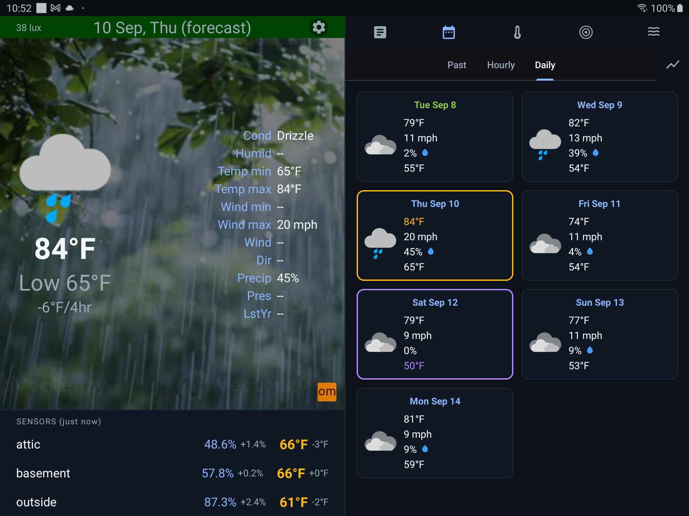
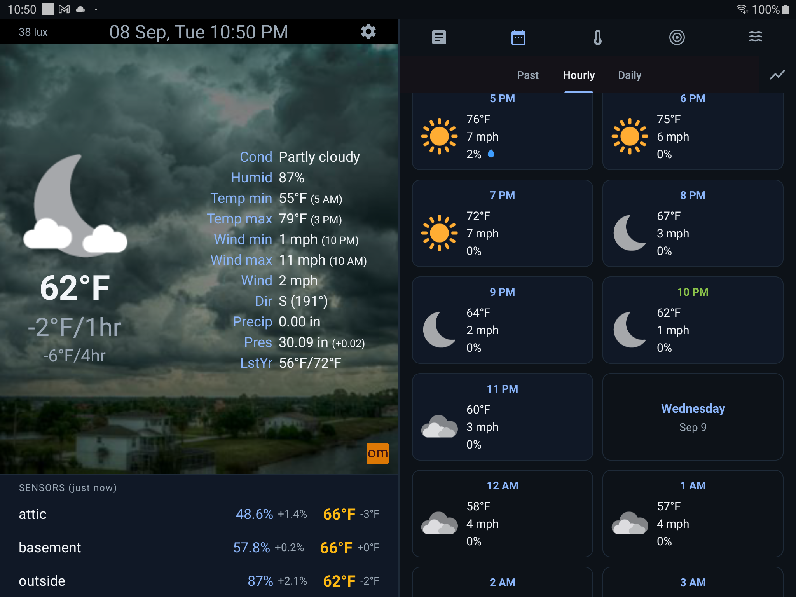
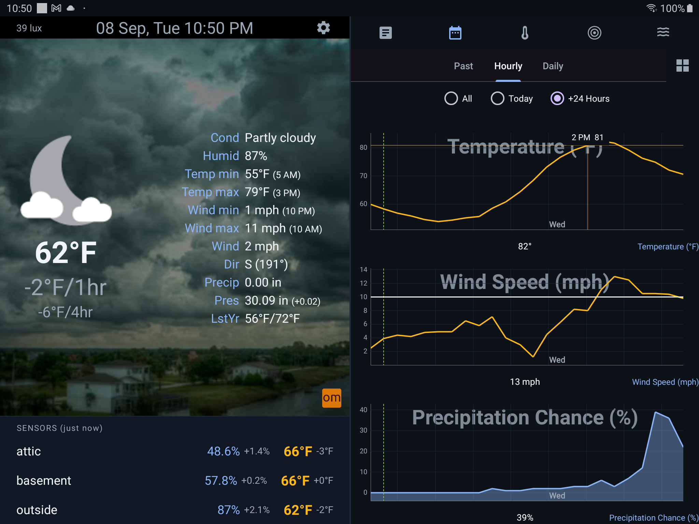
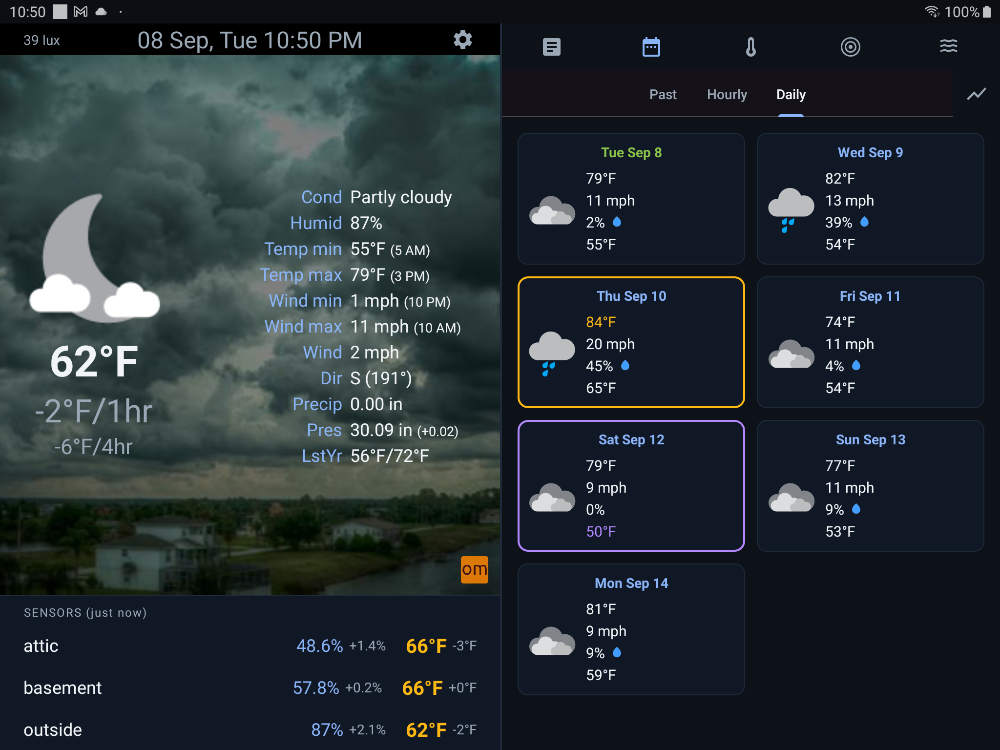
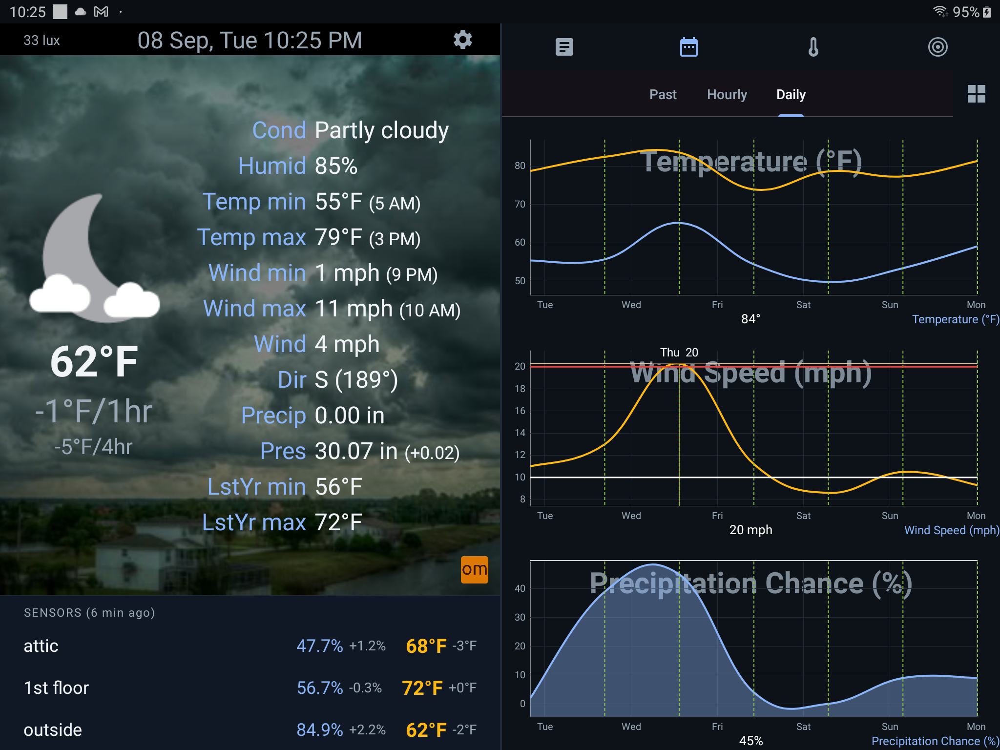
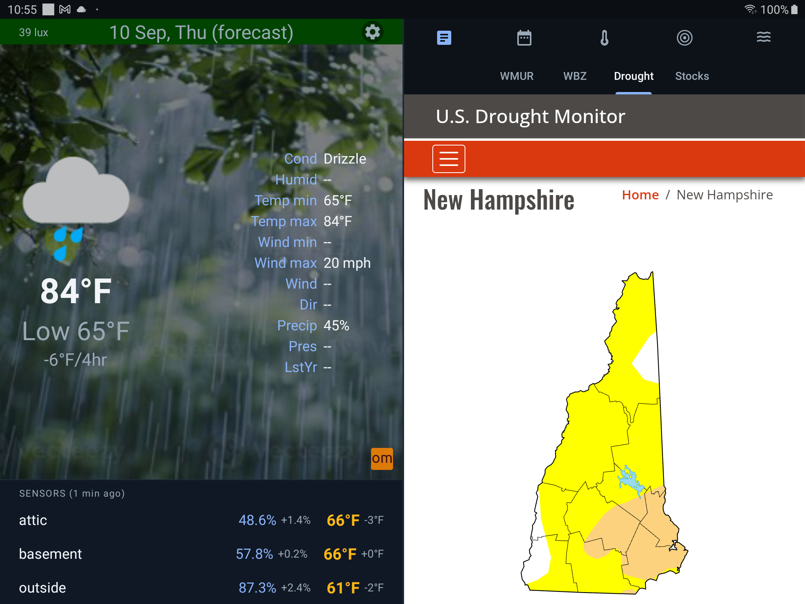
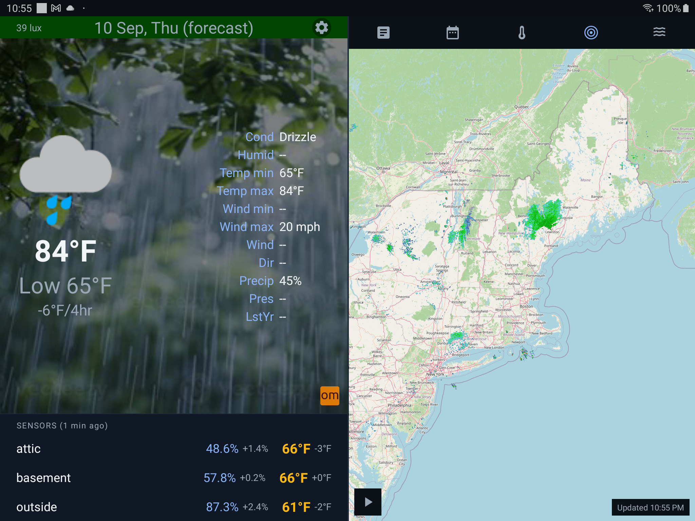
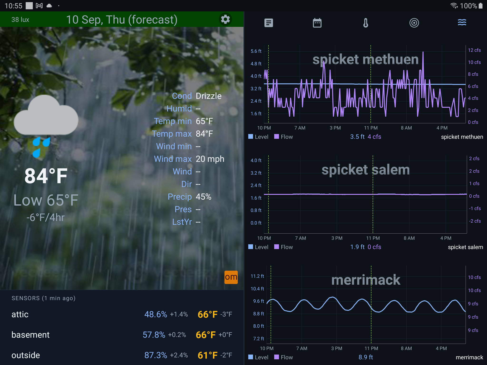
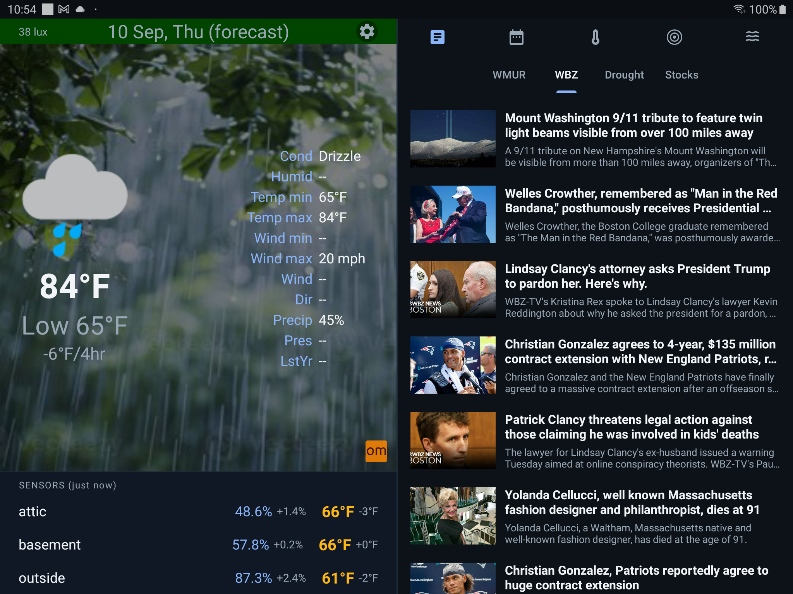
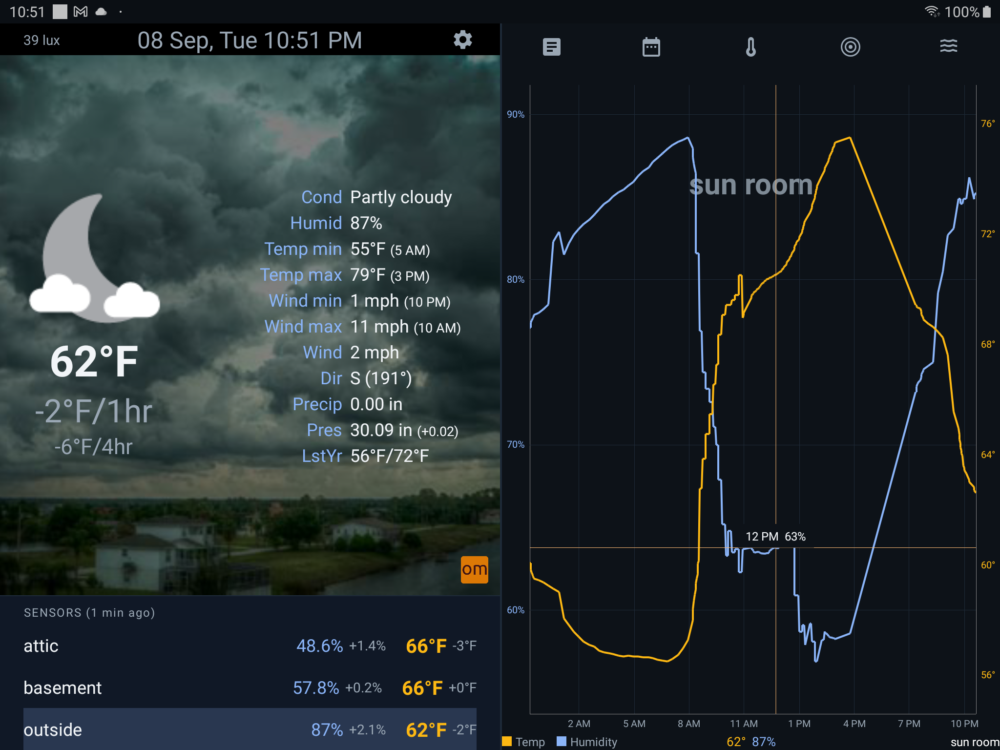

# all-HomeWx

Development in progress

### Screenshots

| | |
|---|---|
| **Forecast**  | **Hourly - Cards**  |
| **Hourly - Graph**  | **Daily - Cards**  |
| **Daily - Graph**  | **Drought Monitor**  |
| **Radar Map**  | **River Gauges**  |
| **RSS Feeds**  | **Indoor Sensor Graph**  |

### License

```
Copyright 2026 Dennis Lang (LanDen Labs)

Licensed under the Apache License, Version 2.0 (the "License");
you may not use this file except in compliance with the License.
You may obtain a copy of the License at

 http://www.apache.org/licenses/LICENSE-2.0
Unless required by applicable law or agreed to in writing, software
distributed under the License is distributed on an "AS IS" BASIS,
WITHOUT WARRANTIES OR CONDITIONS OF ANY KIND, either express or implied.
See the License for the specific language governing permissions and
limitations under the License.
```
See [LICENSE](LICENSE) for the full license text.
